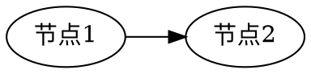

# 配置测试

## 普通文本
&emsp;&emsp;hello world.  
&emsp;&emsp;你好世界。  

## 代码段
c
```c
#include <stdio.h>

int main()
{
    printf("hello world");
    return 0;
}
```

python
```python
import math

if __name__ == "__main__":
    print("hello world")
    print("pi={}".format(math.pi))
```

## katex

$$
\begin{aligned}
& (x_1, y_1) = \lambda(x_2, y_2) \newline
\Rightarrow & \left\lbrace
\begin{aligned}
& x_1 = \lambda x_2 \newline
& x_y = \lambda x_2 \newline
\end{aligned}
\right. \newline
\Rightarrow & x_1 y_2 - x_2 y_1 = 0
\end{aligned}
$$

使用`$`在行内插入 $y = ax^2 + b$  
使用`\\(`和`\\)`在行内插入 \\((x-a)^2+(y-b)^2 = r^2\\)  

使用`$`插入公式为非Katex默认行为, 具体配置在 `extend_head.html` 的 `katexDelimiters` 当中

## viz.js
