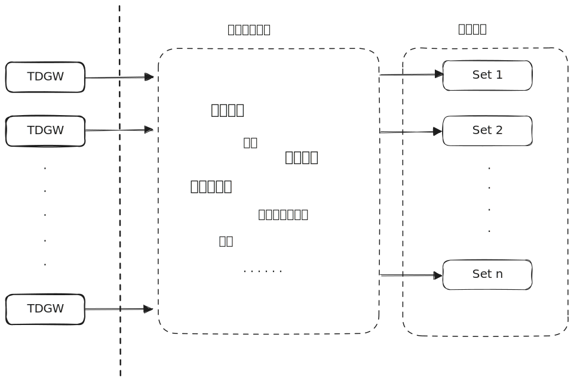

## 声明
这两天上交所交易系统故障的事件在网上闹的沸沸扬扬，甚至出现了一些阴谋论，说什么放跑空头，内部渗透或是只让大机构交易之类的令人啼笑皆非的发言。今天也趁着有空写一篇文章，站在市场参与者的角度，来分析一下这件事。  

此文初衷是总结时间线，记录历史发生的事件，并且根据发生的事件分析交易系统的技术方案，供有相同爱好的交易所/券商/基金从业人员及专业量化投资者互相交流，若有不妥之处，还请联系指正。  

## 事件背景
在股市经历了 3 年慢慢熊途，上证指数于 2024年9月18日 最低跌破 2700 点，经济面临较大下行压力的情况下，我方意识到要以雷霆手段打断可能出现的通缩螺旋，而资本市场也许就是最好的突破口。2024年9月24日，央妈、金融监管总局、证监会组团召开新闻发布会，释放了[超出市场预期的多项政策](https://www.gov.cn/zhengce/202409/content_6976145.htm)，其中的 **证券基金保险公司互换便利** 和 **股票回购增持专项** 接近于明牌，就是要直接拉动资本市场，带起财富效应。  

随后我国股市应声而涨，包括 24 号在内仅用 3 个交易日，直接突破 3000 点，各方资金跑步入场，各券商也出现了难得的排队开户的场面，两市成交额在前一周的 18 号还仅有惨淡的 4793 亿，但是随着政策的发布，一举于 25 号突破万亿。  

## 上交所系统故障时间线
- 2024年9月27日开盘后，市场气氛热烈，交易量爆炸
- 9点32分左右，各券商柜台就陆续注意到上交所和深交所的订单回报较平日开盘时段有较大延迟，上交所甚至有订单 ACK 超过 10 秒的情况，随后两个交易所回报时间都似乎逐步恢复正常
- 9点39分左右，市场上有投资者开始反应，当日上交所订单挂单无响应
- 9点40分，上交所的沟通群里，开始出现反馈说当日竞价平台回报不正常
- 接近10点，市场上已经有大量投资者发现挂单没成交，准备撤单后继续挂单，发送撤单请求后，上交所的撤单也没有响应  
- 10点02分左右，许多基金公司的人员反应当日上交所订单大量异常，不少券商柜台的运维人员也反馈，关于上交所订单的延迟/无回报警告正在刷屏，上交所技术公司已知悉此情况，正在排查中  
- 随后，上交所官网发布公告称：“本所关注到，今日开盘后本所股票竞价交易出现成交确认缓慢的异常。本所已在第一时间关注到相关情况，正在就相关原因进行排查。”  
- 10点15分，上证指数开始接近平拉直线
- 10点18分左右，传言上交所准备进行主备切换
- 11点13分，有些券商发现上交所订单正在开始恢复逐步消化，有的分区正常，有的分区依旧不正常(比如茅台的行情已恢复，但是招商银行的行情依旧在拉直线)
- 11点30分，午间休市，上交所系统故障事件变成了热门谈资，随后成为激活沉睡账户、召唤新股民入市的又一重大新闻  
- 12点25分左右，陆续吃完午饭的券商柜台人员发现，上交所 TDGW 在休市期间打印了一些错误日志，并且做了线路的自动切换
- 13点00分，下午开市，上交所行情不再拉直线，但是回报却较慢
- 13点08分，上交所行情虽然正常推送，但是成交量却不太正常，看起来行为像是做了流量控制
- 15点00分，股票收盘，但是各家券商依旧还能收到成交回报
- 17点30分，上交所的竞价平台依旧在向券商推送订单和成交回报信息
- 接近18点00分，各家券商陆续得到通知，无需等待上交所的推送结果，当日清算以中证登的结果为准
- 次日(2024年9月28日)，上交所进行例行全网测试，并通知于2024年9月29日增加一次通关测试，并紧急发布一个 TDGW 新版本

## 分析

### 上交所当前架构
相比于上期所 2006年11月3日 上线的自研交易系统 NGES，2024年6月11日 已经升级到了 NGES 3.0；深交所 2016 年6月 正式上线的自研交易系统 STSV5；上交所在 2020 年才刚刚开启自研交易系统 G4 项目；当前上交所使用的交易系统，已经开始逐步向 G4 过渡，例如券商对接部分已于 2022 年开始转向流式报盘，并且新架构、新港股通、新期权等也在开发中，但是竞价平台的核心部分仍然在使用上一代交易系统 NGTS，在结合当前的公开资料和咨询十多年前曾参与开发此系统核心撮合部分的朋友之后，可以画出不完整的架构图:  

### 问题分析
上交所和深交所的撮合部分都支持分区(上交所称为 set，深交所称为 partition)，即全市场的所有标的分为 n 组，每组放在一个撮合服务中，所以当一个撮合服务出现问题时，并不会影响全市场的标的。而且此架构支持横向扩展的，即随着时代发展，当市场成交量上涨之后，交易所可以在未来增多分区，以减少单个分区上的压力

* 关于刚开盘时出现的问题，影响到了竞价平台的所有标的，所以不像是遭遇了某台机器的硬件故障，但具体问题，这里不好猜测  
* 11:13 - 11:30，茅台行情恢复正常而招商银行还在拉直线，这证明了当时上交所至少有一个分区出现了问题，而有些分区则正常运行  
* 13:00 - 14:21，成交情况极不正常，但是系统保持运行，而且行情分时图开起来像是短时间内的分时被拉长了，这里有理由怀疑是为了保证市场运行，上交所进行了某种限流操作，即降低处理效率，让订单排队
* 15:00 之后，订单和成交还依然保持推送，这里与上一条联系起来看，比较符合逻辑的推测是，虽然进行了限流操作，但是被限流的订单已经通过了进行交易时间段校验的那个服务，堆积到了交易所撮合服务之前

## 上交所的应对策略推测
这里根据所知的信息，列出个人认为的上交所可能进行的应对策略，并且分析各方法的利弊  
* 不管分配的流速权，直接对网关发来的报单进行统一的限流拒单，防止订单洪峰冲击核心服务
  * 优势：此方法最简单直接，在刚开盘的高峰期可能出现一些交易所拒单，但是随着订单洪峰的过去，可以保证之后的交易正常，而且可以防止报单响应时间过长
  * 劣势: 这只是对外围进行限流，但并无法保证某个核心撮合分区内的订单不出现大量堆积
* 在核心撮合服务之前加入限流，直接拒单而不是订单堆积
  * 优势: 可以直接保护撮合服务，防止出现压垮这系统最核心的部分
  * 劣势: 这个方法看起来与前一条类似，但是有个隐藏的难度，那便是 20 多年前启动的 NGTS 项目时用的可不是 Linux，上面的撮合通讯也不是 socket，而是被称为邮箱的机制，如果当前还是和以前一样的话，那么上交所的人不一定改的动这部分代码
* 扩展分区，在上一小节提到过，深交所和上交所的核心撮合都支持分区，这可以直接提高系统核心的吞吐量
  * 优势: 直接降低每个分区面临的压力，保护系统最核心的部分
  * 劣势: 这里也面临一个问题，对比于深交所已经全面的切到了现代写法的自研系统，上交所的 NGTS 当年用的可不是普通的服务器，而是小型机，现在如果还是这种情况的话，不一定能很快的进行扩展
* 加快进度，推进 G4 尽快替换当前核心部分
  * 优势: 相比于 2001 年就开始启动立项的 NGTS，参加此系统初期建设的人员早已远离开发一线，例如当前上交技术的话事人王泊，核心测试部的几位大哥都是当年参与其中的中青年，而且 NGTS 所使用的当年算是先进的技术，现在早已变为没有年轻人愿意学习的淘汰技术了，再去大幅度翻新难度极大；而 G4 是上交所完全自研的系统，当前一线人员对代码熟悉
  * 劣势: G4 本身也存在一些问题，0505 之后，也让上交所推进速度有所减慢；而且相比于深交所 16 年上线，由当年就小有名气的深证通话事人邹胜带队开发的深交所自研系统，G4 团队是否有实力在短时间内推进到一个可替换竞价平台核心撮合服务的阶段，还无法确定；另外作为国家级别的交易所，交易系统的更新并不是完全由技术人员来把握的，相比于深交所较为进取的风格，上交所的风格一直是较为保守的