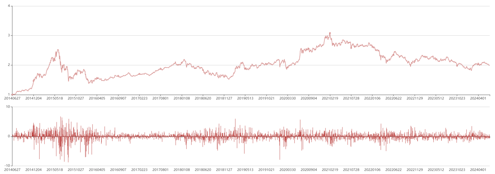

近期(2024-06-30)的 A 股又出现一波流畅的下跌走势，关于打击量化的反智言论再次充斥网络，比如
* 集思录的帖子: [大家觉得量化是不是直接禁掉得了？](https://www.jisilu.cn/question/491397)
* 以及政法大学刘纪鹏教授建议：[暂停量化交易](https://weibo.com/1296760080/OhHh4diKQ)  

这些帖子/视频连基本的事实概念都分不清(甚至无法分清量化交易、程序化交易、算法交易和高频交易是不同的概念)，却能言之凿凿的说为了广大投资者应该停止量化交易，实在令人啼笑皆非。而这些本该令人一笑了之的言论却有着大量的拥趸，实在很难令人置之不理。  

所以这篇文章的目的是希望能做一个基础的科普，让大家能够对量化交易有一个简单的认识。  

## 什么是量化
量化交易，顾名思义，就是以量化的方法来进行交易活动，那么什么是量化呢？其实理工科的学生肯定不会陌生，这里节选 2004 人教版高一物理课本的前言为大家释义：  
> 一天在树下玩耍，一只熟透了的苹果掉下来，他们就辩论起来：苹果是不是越落越快？不过他们很快就达成一致：是的，苹果越落越快。  
> 紫珠说：“只说苹果越落越快，没什么了不起，谁能说出苹果下落怎么个越落越快法？”  
> 黑柱说：“苹果越落越快，就是它的速度正比于落下的距离呗！”  
> 白胖说：“我看是苹果的速度正比于落下的时间”  
> 孩子们七嘴八舌，天色已晚，黄娃建议明天到游戏场去做实验，于是大家就散伙回家了。  
> ......  
> 第二天，老师带孩子们到实验室，通过‘闪频仪’来记录小球下落每隔一定时间间隔的位置，通过实验数据记录，蓝仔发现规律并说：“其实我是吸取了白胖的想法，速度正比于走过的时间”  
> 设第 1 秒末速度为 v，初速度为 0，所以平均速度为 v/2，走过的距离为 v/2 * 1 秒  
> 第 2 秒末速度为 2v，初速度为 v，所以平均速度为 3v/2，走过的距离为 3v/2 * 1 秒  
> 第 3 秒末速度为 3v，初速度为 2v，所以平均速度为 5v/2，走过的距离为 5v/2 * 1 秒  
> 依此类推，为了取整数，可令 v = 2，于是小球在相继各秒下落距离之比就是 1:3:5:7:9:...，如果从零线起算各秒末的总路程，那就是整数的平方 1:4:9:16:25:...  
> ......  
> “物理学是探索自然界最基本、最普遍规律的科学，物理学的一般探索过程是通过观察和实验积累经验，在经验事实的基础上建立物理模型，提出(往往是猜测出)简洁的物理规律(物理学要求这些规律是**定量化的**，也就是用公式或数学表达的)，可用它们去预言未知现象，再用新的实验去检验这些物理模型和物理规律，去否定或进一步修正它们。”  

好了，通过上面短文，我们可以知道什么是**量化**，所以只有你有可量化的策略，并且按照策略去执行，都可以定义为量化交易。并且核心思想也是和物理实验一模一样，先提出假设(定性)，接着将其公式化(量化)，紧接着是实验(回测)，接着根据实验结果否定或进一步修正。  
而且看到这里，相信你也就可以理解，为什么无论是国内的量化私募，还是国外的对冲基金都喜欢数学和物理专业的学生。  

## 一个简单的量化策略

### 定性
很好，上面我们已经解释了**量化**这个词，那么现在我有了一个想法:   买入市场中的蓝筹股，忽略短期波动，始终满仓持有，那么拉长时间看，我能获取超过银行定期存款的利率。  

### 量化
上面这段假设，我们可以将其理解为定性分析，为了对其进行实验，我们要对其进行定量。首先我们要确定取哪一年的多长的周期的定期存款利率，取次要定义什么是蓝筹股。  
由于定期存款利率是实时变化的，我们不妨取近五年内，十年期国债收益率的月末收盘价最高值，即: 3.6%；接着，我们需要定义蓝筹股，不妨定义如下:

先确定我们的股票池子:
* 非ST、*ST 沪深A股和红筹企业发行的存托凭证
* 若科创板证券、创业板证券：上市时间超过一年，其他证券：上市时间超过一个季度，除非该证券自上市以来日均总市值排在前 30 位

接着是定义一个筛选蓝筹的方法:
* 对样本空间内证券按照过去一年的日均成交金额由高到低排名，剔除排名后 50%的证券
* 对样本空间内剩余证券，按照过去一年的日均总市值由高到低排名，选取前 300 名的证券作为指数样本

接下来我们需要按固定的周期调整我们的持仓，这里我就定为每年 6 月和 12 月的第二个星期五的下一交易日好了

### 回测
我们对上面的策略进行回测，这里暂时忽略手续费和滑点

| 起始时间 | 结束时间 | 复合年化 | 夏普 |
| ---- | ---- | ---- | ---- |
| 2014-06-27 | 2024-06-28 | 7.15% | 0.175054 |

### 小结
好了，截至目前，我们完成了一个最为简单的策略，他通过买"蓝筹"的方式，获得了超过"定存"的收益。聪明的你应该已经反应过来了，这不就是全仓买入沪深 300 嘛！！！
是的，你答对了，量化策略其实就在咱们的股民/基民朋友们身边，这里我可以随口说出几个分类：

* 按照市值分类: 沪深300，中证500，中证800，中证1000，中证2000  
* 按照行业分类: 中证能源，中证原材料，中证工业指数，中证可选消费，中证主要消费，中证医药卫生，中证信息技术，中证公用事业......
* 按风格分类: 成长指数，价值指数，红利指数......

除了这些指数类的策略外，其实股民朋友们经常喜欢用的网格策略，集思录网友经常挂在嘴边的双低转债等等，都可以算作是量化交易的范畴。  

## 算法交易
上面一小节已经讲述了简单策略的开发思路，但是忽略了一个细节，就是执行，即下单。当每当换仓时，我们希望能够以尽可能高的价格卖出需要卖的持仓，以尽可能低的价格买入需要买的持仓；而且通常基金换仓时，会有大量的仓位需要开/平，需要将单子拆的尽可能小，减少对市场的冲击，我们将这个拆弹的买卖步骤称为**算法交易**。  

现在，让我们来做个上个时代的美梦，你就是利弗莫尔或巴菲特(好吧，这里也许有点不恰当，毕竟利弗莫尔并不会在乎对市场的冲击)，现在你打电话给你的经纪商，要求他买入 20 万股茅台。一个小时之后，你的经纪商给你回电话说，任务完成，持仓成本现在是 k 元/股。那么问题来了，你如何判断你的经纪商和他的执行交易员团队的执行的结果如何呢？

上面提到尽可能高的价格卖出，尽可能低的价格买入，这里有两个很常用的评价基准，分别为:
* **TWAP**(Time Weighted Average Price): 时间加权平均价格
* **VWAP**(Volume weighted average price): 成交量加权平均价格

即你只需要按这段时间内的 **TWAP** 或 **VWAP** 的价格为基准，对比你的买入成本价，就可以评价你的算法交易的质量了。  

聪明的你读到这，也许又敏锐的注意到：执行下单不一定需要程序进行，由执行交易团队进行也是可以的。所以读到这里我们就可以知道：量化交易不一定是程序化交易，程序化交易只能表示执行阶段。  

这里多提一嘴，其实在上个月，监管的发文当中对算法交易进行了肯定的表述，我个人对此有不同看法，但由于利益相关，这里就不展开说了。  

## 因子
现在我们已经有了一个大方向上的思路(满仓持有沪深300)，并且也有了评价执行下单效果的方法，接着让我们更进一步，我们是否可以想一个策略，获取比沪深 300 更多的收益呢？比如:  
* 将沪深 300 按照ROE排序，取排名前 n 个的标的持有
* 将沪深 300 按照股息率排名，取排民前 n 个的标的持有
* 将沪深 300 按照市值排名，取排民后 n 个的标的持有

我们当然可以通过回测来观察最终的结果，但是这其中有什么原理吗？ 为什么增加了额外的指标，能够得到更好的结果呢？我们不妨将我们添加的指标称为**因子**，通常情况下，无论是高频还是低频的策略，我们需要解释我们的因子，也就是找到因子和收益之间的关系，正相关、负相关还是没有关系？不过这里作为一个面向大众的科普文而不是教程，这里就不展开说明了。  

## 高频交易
现在，要进入最受争议，最让投机亏钱的散户们憎恨的高频交易环节了！那么高频交易和上面说的量化交易有本质的区别吗？并没有，它的方法论完全是一样的，提出假设，验证，再实验；寻找因子，计算因子和收益的相关性，并付诸实际。  

而且高频交易也是一个很广泛的称为，并不是单一的策略类型，甚至有些被大众错误的归类为高频交易的策略，其交易有时候并不频繁，典型的就是各类套利策略，例如
* ETF套利
* 商品的跨品种套利
* 商品的期现套利

而上述的套利策略，不仅不是有害的，更是市场运行必不可少的存在。  

不过也确实存在极短期内对市场造成冲击的策略，例如仅仅关注市场微观结构，例如针对订单簿不平衡做出吃单动作的策略，他们不同于做市策略，不仅无法提供流动性，还会短期内造成盘口价差扩大。但由于 T+1 的限制，在 A 股股票市场中，做 taker 高频策略的比例并不高，之前可转债疯狂过一阵，不过很快就被限制住了  

## 总结
截至目前，已经大致介绍了量化交易，可以看出，大部分的中长期策略，并不会对市场造成负面影响，相反，他们会通过基本面因子(例如高股息率，低波动，较高的价值，较高的质量)，持有优秀的企业，并且不受主观情绪的影响。而且国内量化私募卖的最多的一般都是指数增强类产品，这类产品几乎都处于满仓状态，并不存在某些人口中所谓的砸盘和蓄意影响市场。  

那么有人要说了，如果不是量化，那么现在应该怪罪谁？如果有个游戏，你只要参加了就可以赚到几个亿，如果你输了，惩罚是被罚掉几百万，并且退出这个游戏，不过没有性命之忧，如果你有实力参加这个游戏，你玩不玩？